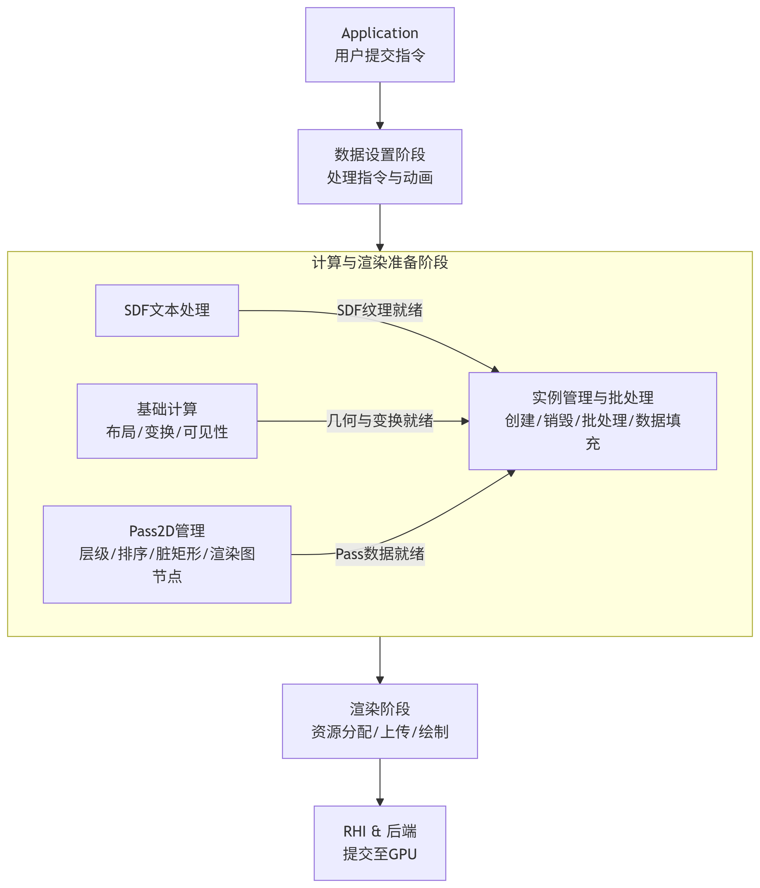

# GUI渲染引擎技术架构与设计手册
**文档版本**: 1.0

**目标读者**: 本库的维护者、核心贡献者

**前置知识**: Rust, 计算机图形学 (Vulkan/Metal/DirectX12), 实体组件系统 (ECS) 范式

## 1.核心设计哲学

本引擎的设计遵循以下几个核心原则：

### 1.1 用户接口（UI）规范与实现
本引擎的UI系统设计核心目标是：为开发者提供一套熟悉、声明式且高性能的界面描述方式。我们选择实现一个主流的、经过验证的开放标准——Web标准的一个性能导向型、安全子集。这使得开发者可以运用其已有的HTML/CSS知识，同时享受Rust带来的性能与安全性优势。

### 设计哲学
1. **熟悉性与生产力**: 采用类HTML/CSS的语法，极大降低学习成本和使用门槛。开发者可以专注于界面逻辑而非底层绘制API。

2. **安全性**: 利用Rust的类型系统和内存安全特性，从根源上避免UI描述中的常见错误（如悬空指针、内存泄漏）。

3. **性能导向**: 并非实现完整的W3C标准，而是精心挑选一个在表现力和性能之间取得最佳平衡的子集。避免实现过于复杂、性能开销大且使用频率低的功能。

4. **可扩展性**: 子集的定义是清晰的，允许未来在有需求和资源时，逐步扩展对更多标准的支持。

### 1.2 实现的W3C标准子集

#### 1.2.1 结构（HTML-like）
我们实现了一个简化的类HTML的DOM树结构，用于描述UI的层次。

* 容器元素: `<div>` 

* 文本元素: `<span>` 用于展示文本

* 图片元素: `` 用于展示图片（明确知道是叶子节点）

* 画布元素: `<canvas>` 用于与其他渲染系统结合， 将其他渲染系统的渲染结果，展示在gui中

* 空元素: `<empty>` 没有实际作用， 可看做是该节点不存在， 直接将其所有子节点与其父节点连接，但使用`<empty>`可使节点结构在一定程度上保持稳定（与pi_direct库结合）

#### 1.2.2 样式（CSS-like）
| 属性 | 描述 | 与CSS标准相比较 |
| ------ | ------ | ------ |
| background-color | 节点的背景颜色 | 仅支持 rgba |
| background | 节点的背景颜色 | 仅支持线性渐变 |
| background-image | 节点的背景图片 | 仅支持url，<font color=red>渐变色请通过background来设置</font>|
| background-repeat | 用于设置节点的背景图片是否重复（repeat）、拉伸（stretch）或铺满（round）或间隔（space） | 仅支持url，<font color=red>渐变色请通过background来设置</font>|
| border-color     | 节点的边框颜色 | 仅支持 rgba |
| border-image-source | 边框使用图像的路径 | |
| border-image-clip | 用于剪切边框图片，将被剪切后的图片作用于边框，仅支持百分比设置剪切范围 | <font color=red>CSS不支持</font> |
| border-image-slice | 图像边界向内偏移 | 仅支持百分比设置 |
| border-image-repeat | 用于设置图像边界是否应重复（repeat）、拉伸（stretch）或铺满（round）或间隔（space) | |
| image | 节点使用图像的路径，作用于填充和边界（但不包括边距） | 与css中background-image描述一致 |
| image-clip | 用于剪切节点图片，将被剪切后的图片作用于节点，仅支持百分比设置剪切范围 | <font color=red>CSS不支持</font> |
| object-fit | 用于设置图像应该如何适应到其使用的高度和宽度确定的框 | object-fit仅作用于节点的image，并新增了可选择的值，object-fit：fill \| contain \| cover \| none \| scale-down \| repeat \| repeat-x \| repeat-y |
| font-family | 规定文本的字体系列 |  |
| font-size | 规定文本的字体尺寸 |  |
| font-weight | 规定字体的粗细 | 仅支持数字设置：100 \| 200 \| 300 \| 400 \| 500 \| 600 \| 700 \| 800 \| 900 |
| color | 设置文本的颜色 |  |
| letter-spacing | 设置字符间距 |  |
| line-height | 设置行高 |  |
| text-align | 规定文本的水平对齐方式 |  |
| text-indent | 规定文本块首行的缩进 |  |
| white-space | 设置怎样给一元素控件留白 |  |
| word-spacing | 设置单词间距 |  |
| text-shadow | 为文本添加阴影 | 仅支持一重阴影，不能定义多个 |
| text-content | 文字内容 |  |
| text-stroke | 文字描边| |
| text-gradient|文本渐变颜色| css使用`background` 和 `background-clip: text`来设置文本的渐变色，gui则提供`text-gradient`来设置文字渐变颜色|
| filter | hsi(h, s, i) \| hue-rotate() \| saturate() \| brightness() \| grayscale() 为节点设置滤镜， 与ps中的hsv效果一致 | <font color=red>CSS不支持hsi函数，其中h为色相转换，值为-180\~180，0表示不变；s为饱和度变换，值为-100\~100，0表示不变，小于0时降低饱和度，大于0时增加饱和度。i为亮度变换，值为-100\~100，0表示不变，小于0表示变暗，大于0变亮。</font> |
| mask-image-source | 遮罩图片url或渐变颜色 | <font color=red>CSS不支持，类似的效果名为：mask-image, 仅支持单通道遮罩（alpha），需要注意的是， 如果使用图片为png或jpg， 引擎实际上使用图片的红色分量(R)作为alpha的值，而没有真正使用图片的Alpha通道</font> |
| mask-image-clip | 遮罩图片的裁剪矩形 | <font color=red>CSS不支持</font> |
| blend-mode | 混合模式：normal \| alpha-add \| one-one \| multiply \| subtract  | <font color=red>CSS有mix-blend-mode属性，但与blend-mode的值完全不同，效果也不同，总的来说都是描述混合模式</font> |
| overflow-wrap | normal \| anywhere \| break-word  | <font color=red>CSS中的该属性与gui中的意义基本一致， 但具体行为有所不同，gui中不区分anywhere和break-word， 并且在布局时，直接根据字符是否溢出选择折行 ，css中是当某不能折行的单位本身超出一行时，对该单位划分折行</font> |
| text-overflow | clip \| ellipsis \| &#60;string&#62;  |  |

##### 布局属性
| 属性 | 属性 | 描述 | 与CSS标准相比较 |
| ------ | ------ | ------ | ------ |
| position | absolute \| relative | |  |
| width | length \| % \|auto | |  |
| height | length \| % \|auto | |  |
| margin | length \| % \|auto | |  |
| margin-top | length \| % \|auto | |  |
| margin-right | length \| % \|auto | |  |
| margin-bottom | length \| % \|auto | |  |
| margin-left | length \| % \|auto | |  |
| display | flex \| none | |  |
| flex-direction | row \| column \| row-reverse \| column-reverse | |  |
| flex-wrap | no-wrap \| wrap \| wrap-reverse | |  |
| justify-content | flex-start \| flex-end \| center \| space-between \| space-around \| space-evenly | |  |
| align-items | flex-start \| flex-end \| center \| baseline \| stretch | |  |
| align-content | flex-start \| flex-end \| center \| baseline \| stretch \| space-around| |  |
| align-self | auto \| flex-start \| flex-end \| center \| baseline \| stretch | |  |
| order | number| |  |
| flex-basis | auto \| length \| % | |  |
| flex-grow | number | |  |
| flex-shrink | number | |  |
| top | auto \| length \| %  | |  |
| right | auto \| length \| %  | |  |
| bottom | auto \| length \| %  | |  |
| left | auto \| length \| %  | |  |
| padding | top right bottom left | |  |
| padding-top | auto \| length \| %  | |  |
| padding-right | auto \| length \| %  | |  |
| padding-bottom | auto \| length \| %  | |  |
| padding-left | auto \| length \| %  | |  |
| border-width | top right bottom left | |  |
| border-top | auto \| length \| %  | |  |
| border-right | auto \| length \| %  | |  |
| border-bottom | auto \| length \| %  | |  |
| border-left | auto \| length \| %  | |  |
| min-width | auto \| length \| %  | |  |
| min-height | auto \| length \| %  | |  |
| max-width | auto \| length \| %  | |  |
| max-height | auto \| length \| %  | |  |
| aspect-ratio | number | 暂时不支持 TODO |  |


##### 其它属性
| 属性 | 描述 | 与CSS标准相比较 |
| ------ | ------ | ------ |
| pointer-events | 定义元素如何响应点查询 | 仅支持auto \| none \| visible |
| display | 设置一个元素应如何显示 | 仅支持flex \| none |
| visibility | 设置一个元素应如何显示 | 仅支持visible \| hidden |
| z-index | 设置节点在z轴上的顺序 | |
| transfrom | 设置节点的空间变换 | 仅支持scale \| scaleX \| scaleY \| translate \| translateX \| translateY \| rotate \| rotateZ\| rotateX\| rotateY |
| translate | 移动变换 | 与css一样 |
| scale | 缩放变换 | 与css一样 |
| rotate | 旋转变换 | 该属性进支持Z变换，写法：`rotate: 20deg`,如需其他轴变换，请用`transform` |
| will-change-transform | 用于优化频繁变化的transform，不需值，只需要声明该属性 | <font color=red>CSS不支持</font> |
| opacity | 不透明度 | 当父子节点同时设置opacity， 效果差异较大（可以自己实验） |
| overflow | 设置内容溢出如何显示 | 值为true \| false |
| scroll-behavior| 指定滚动行为， 可选值:auto\|smooth |  与标准实现有差异，auto表示仅跟随指针滚动， smooth在指针取消后，仍然可平滑滚动一段时间|
| animation| 动画属性 |  |
| clip-path| 裁剪路径 | 支持基本形状：circle、ellipse、inset，除此之外，css中定义的其他剪切路径不支持。扩展了一个基本形状sector（扇形），语法为：sector(扇形边缘1绕x轴的旋转 扇形边缘2绕x轴的旋转 半径 [at < position >]),<br/> <font color=red>例：clip-path: sector(0deg 0deg 40px); clip-path: sector(0deg 0deg 40px at 30px 20%)</font><br/><font color=red>注意：css标准支持clip-path中声明多个剪切路径， gui目前只能声明一个</font>  |

##### 样式表（Stylesheet）:
支持Class选择器和内联样式

#### 1.2.3 SVG

#### 1.2.4 Fragment
传统浏览器通过解析html、css字符串来渲染dom，解析过程需要花费一定时间， 为高效与现代MVVM体系结构（如vue）结合， 本引擎提供静态数据的二进制接口， 使得MVVM框架在编译时就能将静态数据二进制话， 运行时解析数据花费更少的时间。该二进制在本引擎中被称为**Fragment**（片段）， 引擎中用片段表存储所有传入的片段， 片段表的结构为：
```rust
    pub struct FragmentMap {
        pub style_buffer: Vec<u8>, // 样式序列化数据
        pub fragments: Vec<NodeFragmentCmd>, // 每节点的片段数据描述
        // 每个片段描述了一颗只有一个根节点的树，并用一个u32命名（通常是编译时片段的hash值）
        // Range<usize>指定了节点范围，该范围内的节点就是该片段中的节点
        pub map: XHashMap<u32/*片段名称*/, Range<usize>/*节点范围（在字段fragments中的索引范围）*/>, 
    }

    pub struct NodeFragmentCmd {
        pub tag: NodeTag,
        pub parent: usize, // 在Vec<NodeFragmentCmd>中的索引
        pub style_meta: ClassMeta,
        pub class: ClassName,
    }

    pub struct ClassMeta {
        pub start: usize,                         // 在某个style_buffer中的开始偏移
        pub end: usize,                           // 在某个style_buffer中的结束偏移
        pub class_style_mark: BitArray<[u32; 4]>, // 标记class中的有效属性
    }
```

在注册了片段表之后， 可以使用片段名称，创建一颗节点树

### 2. 平台可移植性与后端抽象:

**目标**: 支持多图形API（Vulkan, Metal, DirectX 12, WebGPU）。

**体现**: 定义了一套精简且高效的GraphicsAbstraction层（如wgpu或pi_wgpu抽象层）。核心渲染逻辑只与抽象层交互，由各后端具体实现。所有平台相关代码被严格隔离在后端模块中。

### 3. 声明式与显式依赖调度（渲染图）:

**目标**:

 * **显式依赖管理**： 彻底解决渲染Pass之间的资源读写依赖和同步问题，避免出现“帧间同步幽灵bug”或“资源读写竞争”，这是现代图形API（Vulkan/DX12/Metal）编程中最易出错的地方。

 * **最大化并行化**： 允许引擎在满足所有显式依赖的前提下，自动寻找可并行执行的渲染Pass，最大化利用CPU多线程能力来录制命令列表。

### 4. **数据驱动 (Data-Oriented) & Entity-Component-System (ECS) 集成**:

**目标**: 

* 最大化缓存友好性，利用现代CPU的并行能力，减少帧时间。
* 实现渲染逻辑与游戏/应用逻辑的高效、解耦的协作

**体现**: 数据与逻辑分离， 数据连续存储在Component中， 每个逻辑（System）专注处理一类数据。

#### 架构总览与数据流:
整个处理管线是一个线性的、阶段化的数据转换过程，每个阶段由不同的ECS System负责。下图描绘了数据从用户定义到最终渲染的完整旅程：



#### 4.1 阶段详解与系统职责（基础能力）

##### 阶段 1: 用户指令设置 (Application Setting)
用户代码创建实体(Entity)，并设置样式。

例： 
``` rust
let node = spawn_empty(); 
user_cmd.set_style(node, ZIndexType(1000));
```
从阶段2开始， 是由帧推驱动ecs执行的

##### 阶段 2: 数据设置 (Data Setup)
此阶段是流水线的起点，负责处理外部输入和持续的动画状态更新。
|System|职责描述|
|-|-|
|user_setting*|将用户指令（如 set_style）应用至对应实体的样式组件|
|transition_*|处理 transition 属性，将属性变化转换为运行时动画数据|
|calc_animation_*|动画系统：负责动画的绑定、状态管理、运算和最终样式写入|
|calc_has_animation*|标记节点是否存在活动动画，用于后续优化（缓存稳定节点的渲染结果）|

##### 阶段 3: 计算与渲染准备 (Computation & Rendering Preparation)
这是核心阶段。其中的系统虽有执行顺序，但更关键的是数据依赖关系。一旦某个系统所依赖的组件数据准备就绪，它就可以被执行。这使得布局计算、Pass管理和实例批处理等得以高效地并行或重叠执行。本阶段包含了两类系统：

1. **基础系统**：实现渲染管线核心逻辑的必要系统，其行为是所有渲染效果的基石。

2. **扩展系统**：基于泛型实现的、用于提供特定渲染效果的可选系统（见4.2节）。

###### SDF支持 (并行分支)
|System|职责描述|
|-|-|
|draw_sdf|异步加载或生成SDF文本纹理|
|update_sdf2_texture|将准备好的SDF纹理更新到对应的绑定组中，供着色器使用|

###### 基础计算 (核心数据生产)
|System|职责描述|
|-|-|
|calc_layout|**布局计算**，根据样式计算节点的位置和尺寸|
|cal_matrix|**世界变换**，计算节点的全局变换矩阵（GlobalTransform）|
|cal_quad|计算渲染**几何包围盒**|
|calc_zindex|计算渲染**深度**|
|calc_show|计算**可见性**|
|image_load<S,D,T>|异步加载节点所需的纹理图片|

###### Pass2D管理 (渲染层级与优化)
此部分系统负责管理Pass2D的创建、排序和资源配置，是渲染流程的核心调度者。

|System|职责描述|
|-|-|
|pass_mark<Overflow>|溢出处理标记：标记需要处理内容溢出的节点（如滚动条）。此标记会直接影响后续 calc_pass_dirty_rect（脏区域计算）、calc_camera（相机和FBO计算）的等行为，例如FBO需要被设置为内容的实际大小而非节点布局大小。	|
|overflow_post_process|旋转节点设置overflow=true，需要使用fbo渲染， 拷贝回gui采用后处理的方式拷贝|
|pass_mark<TransformWillchange>|**变换优化标记**：提示引擎该节点的变换属性可能频繁变化（如涉及CSS will-change: transform 或动画）。这会影响渲染策略，例如可能影响脏矩形计算或触发特定的优化路径。|
|pass_mark\<T\>|其他Pass标记，标记为Pass2D节点（扩展能力,见4.2节）|
|root_calc|标记根节点为Pass2D节点|
|set_pass_relation|设置Pass2D的Parent和节点InPass|
|calc_pass_children|计算Pass2D的ChildrenPass|
|mark_world_invert|计算Pass的逆矩阵|
|calc_world_invert|标记需要计算世界矩阵逆矩阵的Pass|
|calc_pass_toop_sort|对Pass2D进行拓扑排序|
|calc_pass_dirty_rect|计算每个Pass2d的脏区域|
|init_root_graph|异步加载节点所需的纹理图片|
|update_graph|每Pass2D一个图节点， 更新渲染图节点， 并设置节点依赖关系|
|calc_content_box|计算Pass2D的内容最大区域|
|calc_camera|计算每Pass2D的相机，已经释放多余的缓存Fbo|
|calc_is_steady|异步加载节点所需的纹理图片|
|calc_pass_active|计算Pass在本帧中是否渲染有效|

##### 实例管理与批处理 (数据消费与渲染指令生成)

|System|职责描述|
|-|-|
|draw_object_life_new\<S\>|**实例生命周期管理**，根据节点状态创建或销毁渲染实例|
|update_render_instance_data|分配实例数据，设置渲染深度、纹理绑定组|
|set_matrix_uniform|设置实例的矩阵、布局数据|
|set_show_data|设置实例是否显示|
|set_pass_instance|设置Pass2D拷贝到父Pass2D的矩阵、布局|
|batch_instance_data|批处理实例数据|


##### 阶段 4 & 5: 渲染与提交 (Rendering & Submission)

|System|职责描述|
|-|-|
|渲染图 Build|**资源分配**：根据渲染图节点声明，分配本帧所需的FBO、纹理等资源。|
|last_update_wgpu|**数据上传**：将批处理好的实例数据、相机数据等最终上传至GPU显存。|
|渲染图 Run|**命令录制**：遍历渲染drawcall，绑定管线与资源，调用绘制命令。|
|RHI & 后端|**API转换与提交**：转换为原生API调用，处理同步并提交至GPU队列。|

#### 4.2 可扩展性机制：泛型系统与组件
本引擎的核心架构支持通过泛型系统（Generic Systems） 和特定组件来扩展渲染功能。这种设计允许维护者为新的渲染效果（如新的后处理、新的绘制类型）添加功能，而无需修改引擎的核心流程。

##### 扩展点一：Pass2D 类型扩展
不同的视觉效果（如模糊、色调调整、裁剪）需要不同的离屏渲染和合成策略。通过泛型 PassMark<T> 系统，可以为节点标记特定类型的 Pass2D，每种类型拥有自己的后处理配置。

|Pass类型(T)|标记系统|后处理配置系统|功能描述|
|-|-|-|-|
|AsImage|pass_mark\<AsImage\>|as_image_post_process|将节点子树渲染到纹理，并将结果作为图像拷贝到GUI的父Pass中。用于实现元素缓存或自定义渲染内容。|
|Blur|pass_mark\<Blur\>|blur_post_process|对节点子树的应用区域进行高斯模糊处理。用于实现背景毛玻璃效果等。|
|ClipPath|pass_mark\<ClipPath\>|clip_path_post_process|使用自定义路径对节点子树进行裁剪。|
|Hsi|ppass_mark\<Hsi\>|hsi_post_process|对节点子树进行色相、饱和度、明度调整。|
|Opacity|pass_mark\<Opacity\>|opacity_post_process|为节点子树设置独立的透明度组。与父节点的透明度相乘为最终结果。|
|（未来扩展）|pass_mark\<YourPass\>|your_post_process|只需定义新的类型并实现对应的后处理配置系统即可扩展新的Pass类型。|

**工作流程**:

**标记**: pass_mark<T> 系统根据业务逻辑或组件数据，将实体标记为某种特定的 Pass2D。

**配置**: 对应的 ..._post_process 系统会为该类型的Pass配置特定的后处理数据。

**管理**: 后续的Pass管理系统（如 update_graph）会统一处理所有类型的 Pass2D，为它们创建渲染图节点、计算脏矩形等，实现自动化管理。

##### 扩展点二：DrawObj 绘制对象扩展

不同的样式属性需要生成不同的GPU绘制指令和数据。通过泛型 draw_object_life_new\<S\> 系统，可以为节点创建特定类型的渲染对象（DrawObj），每种类型负责处理自己的数据。

|DrawObj类型（S）|实例生命周期系统|数据计算系统|功能描述|
|-|-|-|-|
|BackgroundColor|draw_object_life_new\<BackgroundColor\>|calc_background_color|计算并填充节点的背景颜色数据到实例缓冲区。|
|BackgroundImage|draw_object_life_new\<BackgroundImage\>|calc_background_image|处理背景图片的纹理、缩放、平铺，并填充数据。|
|BorderColor|draw_object_life_new\<BorderColor\>|calc_border_color|计算并填充节点的边框颜色数据。|
|BorderImage|draw_object_life_new\<BorderImage\>|calc_border_image|处理边框图片的纹理和九宫格切片数据。|
|BoxShadow|draw_object_life_new\<BoxShadow\>|calc_box_shadow|计算阴影的偏移、模糊、扩散等参数并填充数据。|
|Canvas|draw_object_life_new\<Canvas\>|calc_canvas_graph|处理自定义Canvas绘制的指令集和纹理。|
|TextContent|draw_object_life_new\<TextContent\>|calc_sdf2_text|计算SDF文本的几何、纹理坐标、颜色等数据。|
|（未来扩展）|draw_object_life_new\<YourDrawObj\>|calc_your_data|只需定义新的类型并实现对应的数据计算系统即可扩展新的绘制对象。|

**工作流程**:

**创建实例**: draw_object_life_new\<S\> 系统检测到实体具备创建某类 DrawObj 的条件（如拥有 BackgroundColor 组件），便会为其创建和管理渲染实例。

**计算数据**: 对应的 calc_... 系统负责在每帧计算该类型绘制对象所需的特有数据（如颜色、UV、特效参数）。

**批量上传**: 所有实例的通用数据（如变换矩阵）和特有数据被批量处理并最终由 last_update_wgpu 系统上传至GPU。

#### 架构优势
**高内聚低耦合**: 每个渲染功能（如模糊、边框）的代码（创建、配置、数据计算）都封装在自已的泛型系统和组件中，与核心流水线解耦。

**易于维护和扩展**: 添加一个新效果（如渐变Gradient）变得非常清晰：

* 定义 **Gradient** 组件来存储参数。

* 实现 **draw_object_life_new<Gradient>** 来创建实例。

* 实现 **calc_gradient** 来计算渐变颜色数据。

* 无需修改任何现有核心系统。

**运行时灵活性**: 可以根据组件的动态添加和移除，在运行时改变元素的渲染方式，系统会自动处理实例的创建和销毁。

这种设计使得本引擎不仅仅是一个固定的渲染器，而是一个强大的、可扩展的**渲染框架**。


